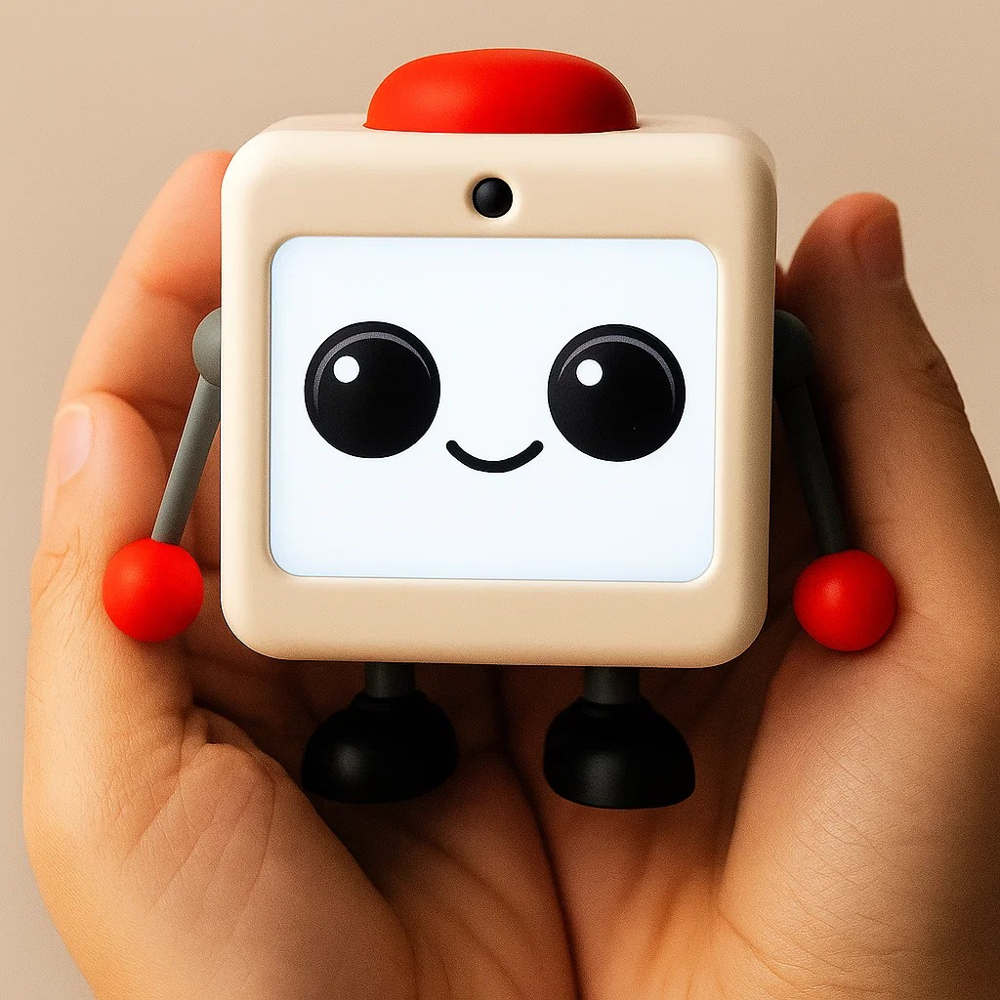

# Neru-bot



## O que é o Neru-bot?

O Neru-bot foi projetado para ser um companheiro que guia os jovens a viverem uma vida com mais propósito e alegria. Ele aborda os desafios do vício em redes sociais, da procrastinação e dos sentimentos negativos resultantes, como ansiedade e frustração.

### O Problema

Os jovens passam muito tempo em seus celulares, o que leva à falta de produtividade e a emoções negativas. As soluções existentes muitas vezes falham por não abordarem as causas profundas, como a necessidade de conexão social ou a dificuldade em manter novos hábitos.

### Nosso Objetivo

Oferecer um companheiro que ajude os usuários a construir uma vida com propósito e alegria.

## Valores Fundamentais

*   **Praticidade**: Reduzir o atrito, minimizar o texto e as ações do usuário, e usar mais imagens.
*   **Intimidade**: Ser pessoal, único e amigável. Customizável e personalizado.
*   **Acessibilidade**: Utilizável por todos, conversacional e fácil de entender.
*   **Qualidade**: Atenção aos detalhes, com base em pesquisas e métodos empíricos.
*   **Diversão**: Designs envolventes, bonitos e criativos.

## Funcionalidades

O Neru-bot foi projetado para ajudar os usuários em quatro áreas principais:

1.  **Reduzir o Uso de Aplicativos Dopaminérgicos**:
    *   Bloqueio de aplicativos por tempo e horário.
    *   "Nudges" e neutralização de recompensas excessivas de outros aplicativos (ex: modo de tons de cinza).
    *   Oferecer maneiras alternativas de satisfazer necessidades como conexão social e curiosidade.

2.  **Promover Atividades Produtivas**:
    *   Descobrir e se envolver em hobbies e interesses criativos.
    *   Definir e trabalhar em direção a metas pessoais com funcionalidades como listas de tarefas e calendários.
    *   Ferramentas para ajudar os usuários a começarem tarefas facilmente.

3.  **Melhorar o Bem-Estar**:
    *   Promover hábitos de sono saudáveis.
    *   Incentivar exercícios diários, hidratação e pequenas rotinas, como arrumar a cama.

4.  **Manter a Motivação e o Engajamento**:
    *   Um sistema de dicas, rotinas e recompensas para construir hábitos.
    *   Funcionalidades como um sistema de Gacha, insights diários, colagens de fotos e gamificação.

## Telas do Aplicativo

1.  **Produtividade**: Gerencie tarefas, hobbies e metas.
2.  **Quests**: Configure definições, acompanhe conquistas e complete missões.
3.  **Agente de IA**: Um companheiro de IA para introspecção e descoberta de novos interesses.
4.  **Recompensas**: Colete itens através de um sistema de Gacha e compita com amigos.
5.  **Journal**: Um diário dos sonhos com colagens de fotos, recomendações semanais e estatísticas de progresso.

## TO-DO

1.  Organizar a estrutura da aplicação.
2.  Desenvolver os componentes de IA.
3.  Desenvolver as principais funcionalidades da aplicação.
4.  Criar o site do projeto.
5.  Idealização de um robô físico companheiro.

## Project setup

```bash
$ pnpm install
```

## Compile and run the project

```bash
# development
$ pnpm run start

# watch mode
$ pnpm run start:dev

# production mode
$ pnpm run start:prod
```

## Run tests

```bash
# unit tests
$ pnpm run test

# e2e tests
$ pnpm run test:e2e

# test coverage
$ pnpm run test:cov

pnpx ts-node src/ai/services/teste.ts

pnpx ts-node src/stargazer/services/testImage.ts src/stargazer/services/notebook.jpg "Put the notebook and pencil on the table"
```

## Deployment

```bash
$ pnpm install -g mau
$ mau deploy
```
